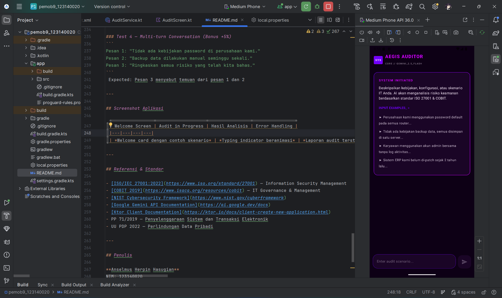
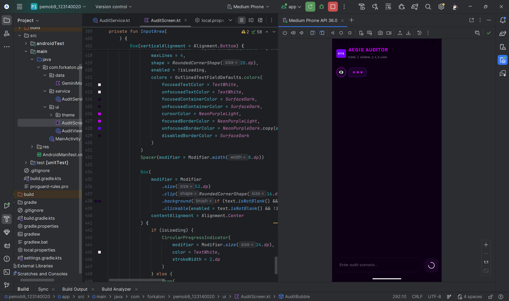
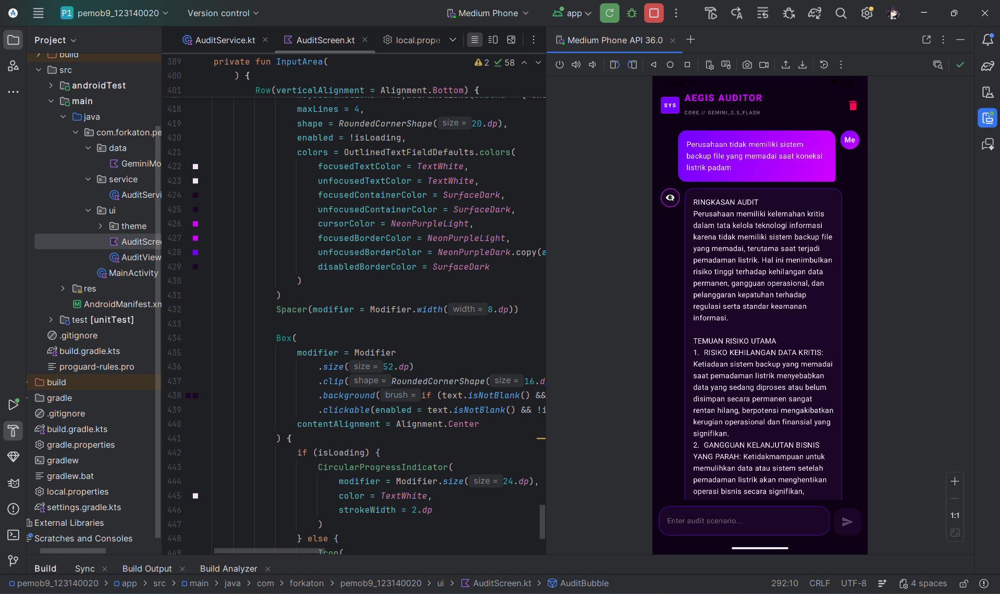
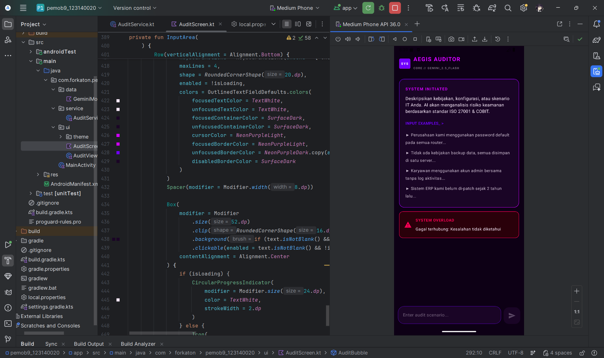

# Aegis Auditor — IT Audit AI Assistant

<div align="center">


**Aplikasi Asisten Audit Tata Kelola Sistem Informasi berbasis AI**

*Tugas Praktikum Pengembangan Aplikasi Mobile — Pertemuan 9: Integrasi AI API*
*Program Studi Teknik Informatika — Institut Teknologi Sumatera (ITERA)*

</div>

---

## Deskripsi Proyek

**Aegis Auditor** adalah aplikasi Android berbasis AI yang berperan sebagai asisten **Senior Information Systems Auditor**. Dibangun menggunakan arsitektur MVVM modern dengan Jetpack Compose dan Ktor Client, aplikasi ini memanfaatkan **Google Gemini 2.5 Flash API** untuk menganalisis skenario kebijakan, konfigurasi sistem, dan topologi jaringan IT secara mendalam.

Setiap analisis menghasilkan laporan audit terstruktur mencakup identifikasi celah keamanan, tingkat keparahan risiko, dan rekomendasi mitigasi konkret — semuanya mengacu pada standar industri internasional **ISO/IEC 27001:2022**, **COBIT 2019**, dan **NIST Cybersecurity Framework**.

---

## Pemenuhan Rubrik Penilaian

| Kriteria | Bobot | Implementasi |
|---|---|---|
| **AI Integration** | 30% | Ktor Client + Gemini 2.5 Flash API + proper service layer (`AuditService.kt`) |
| **Prompt Engineering** | 25% | System prompt CISA/ISO 27001 persona dengan format output wajib terstruktur |
| **Error Handling** | 20% | `AuditError` sealed class + Retry Exponential Backoff 3x + per-status error |
| **UI/UX** | 15% | Loading indicator animasi, error card, welcome card, auto-scroll, dark mode |
| **Code Quality** | 10% | Arsitektur MVVM clean, separation of concerns, StateFlow |
| **Bonus: Multi-turn** | +5% | `conversationHistory` menyimpan konteks percakapan lintas pesan |

---

## Fitur Utama

### CISA/ISO 27001 Persona Engine (Prompt Engineering — 25%)
AI dikonfigurasi secara ketat menggunakan **System Prompt berlapis** dengan pola:
- **Role:** Senior Information Systems Auditor bersertifikasi (CISA, ISO 27001 Lead Auditor)
- **Task:** Analisis celah keamanan dan risiko kepatuhan
- **Format:** Output wajib berstruktur (Ringkasan → Temuan → Keparahan → Mitigasi → Skor)
- **Constraint:** Bahasa Indonesia profesional, referensi klausul standar spesifik, tolak input di luar konteks IT

### Multi-turn Conversation Memory (Bonus +5%)
Aplikasi menyimpan `conversationHistory` sehingga AI mengingat konteks percakapan sebelumnya. System prompt hanya dikirim sekali di pesan pertama untuk efisiensi token.

###️ Enterprise-Grade Error Handling (20%)
Sistem penanganan error berlapis menggunakan `sealed class AuditError`:
- **Retry Exponential Backoff** — otomatis retry hingga 3x untuk error sementara (429, 5xx)
- **Per-status error messages** — 401/403 Unauthorized, 429 Rate Limited, 5xx Server Error, Network Error
- **Rollback history** — history percakapan di-rollback jika request gagal total
- **Retryable flag** — membedakan error yang bisa dicoba ulang vs error permanen

### Cyberpunk / Neon Dark UI (15%)
Antarmuka modern dirancang khusus dengan Jetpack Compose:
- **Animated typing indicator** — tiga dots beranimasi dengan `InfiniteTransition`
- **Welcome card** — contoh skenario audit interaktif saat pertama buka
- **Dual-tone chat bubbles** — user (biru, kanan) vs AI (hijau gelap, kiri) dengan avatar
- **Error card** — tampilan merah dengan ikon warning dan pesan yang informatif
- **Auto-scroll** — otomatis scroll ke pesan terbaru
- **Reset session** — tombol hapus riwayat di toolbar

---

##  Teknologi & Arsitektur

```
┌─────────────────────────────────────────┐
│             Presentation Layer          │
│   AuditScreen.kt (Jetpack Compose UI)   │
│   - ChatBubble, TypingIndicator         │
│   - WelcomeCard, ErrorCard, InputArea   │
└──────────────────┬──────────────────────┘
                   │ StateFlow
┌──────────────────▼──────────────────────┐
│             ViewModel Layer             │
│   AuditViewModel.kt                     │
│   - retryWithBackoff()                  │
│   - analyzeIT() / resetSession()        │
│   - AuditUiState management             │
└──────────────────┬──────────────────────┘
                   │ suspend fun
┌──────────────────▼──────────────────────┐
│             Service Layer               │
│   AuditService.kt                       │
│   - Ktor HttpClient (CIO Engine)        │
│   - System Prompt Engineering           │
│   - Multi-turn conversationHistory      │
│   - Gemini 2.5 Flash API call           │
└──────────────────┬──────────────────────┘
                   │ HTTP POST
┌──────────────────▼──────────────────────┐
│          Google Gemini 2.5 Flash API    │
│   generativelanguage.googleapis.com     │
└─────────────────────────────────────────┘
```

| Komponen | Teknologi |
|---|---|
| **Architecture** | MVVM (Model-View-ViewModel) |
| **UI Toolkit** | Jetpack Compose (Material 3) |
| **Networking** | Ktor Client 3.0.0 (CIO Engine) |
| **Serialization** | kotlinx.serialization 1.6.3 |
| **AI Model** | Google Gemini 2.5 Flash API |
| **State Management** | Kotlin StateFlow + ViewModelScope |
| **Build System** | Gradle 9.x + Version Catalog (TOML) |
| **Min SDK** | API 24 (Android 7.0) |
| **Target SDK** | API 35 (Android 15) |

---

## Struktur Proyek

```
pemob9_123140020/
├── app/
│   ├── src/
│   │   └── main/
│   │       ├── java/com/forkaton/pemob9_123140020/
│   │       │   ├── data/
│   │       │   │   └── GeminiModels.kt        # Data class Request/Response/UiState/Error
│   │       │   ├── service/
│   │       │   │   └── AuditService.kt        # Ktor client + Prompt Engineering + API call
│   │       │   ├── ui/
│   │       │   │   ├── theme/
│   │       │   │   │   ├── Color.kt           # Definisi warna tema
│   │       │   │   │   ├── Theme.kt           # Material3 dark theme
│   │       │   │   │   └── Type.kt            # Typography
│   │       │   │   ├── AuditViewModel.kt      # State management + retry logic
│   │       │   │   └── AuditScreen.kt         # Seluruh Composable UI
│   │       │   └── MainActivity.kt            # Entry point aplikasi
│   │       ├── res/
│   │       │   └── xml/
│   │       │       └── network_security_config.xml
│   │       └── AndroidManifest.xml
│   └── build.gradle.kts                       # App-level dependencies
├── gradle/
│   └── libs.versions.toml                     # Version catalog
├── build.gradle.kts                           # Project-level plugins
├── local.properties                           # API Key (TIDAK di-commit)
└── README.md
```

---

##  Keamanan API Key

Proyek ini menerapkan **Security Best Practices** sesuai materi kuliah:

```
 API Key TIDAK pernah di-commit ke repository
 Disimpan di local.properties (ada di .gitignore)
 Dibaca via BuildConfig pada compile time
 Tidak ter-expose di source code manapun
```

Pastikan `.gitignore` memuat:
```gitignore
local.properties
```

---

##  Cara Menjalankan Aplikasi

### Prasyarat
- Android Studio Ladybug (2024.2.x) atau lebih baru
- JDK 21
- Emulator Android API 35+ atau perangkat fisik Android 7.0+
- API Key Google Gemini (gratis di [aistudio.google.com](https://aistudio.google.com))

### Langkah-langkah

**1. Clone repositori**
```bash
git clone https://github.com/[username]/pemob9_123140020.git
cd pemob9_123140020
```

**2. Buat file `local.properties`** di root directory (jika belum ada)
```properties
sdk.dir=C\:\\Users\\[nama_kamu]\\AppData\\Local\\Android\\Sdk
GEMINI_API_KEY=masukkan_api_key_gemini_anda_di_sini
```

**3. Dapatkan API Key Gemini (Gratis)**
```
1. Buka https://aistudio.google.com
2. Klik "Get API key" → "Create API key in new project"
3. Copy API key → paste ke local.properties
```

**4. Sync dan Build**
```
File → Sync Project with Gradle Files
Build → Rebuild Project
```

**5. Jalankan aplikasi**
```
Run → pilih emulator/device → klik ▶
```

---

##  Skenario Testing

### Test 1 — AI Integration (30%)
Input:
```
Perusahaan kami menggunakan satu akun admin bersama untuk 
semua karyawan IT, tanpa log aktivitas apapun.
```
 Expected: Laporan audit terstruktur dengan 5 section lengkap

### Test 2 — Prompt Engineering (25%)
Input:
```
Server database kami dapat diakses dari luar kantor 
tanpa VPN, menggunakan password default bawaan vendor.
```
 Expected: Referensi klausul ISO 27001 spesifik + Skor Kepatuhan 0-100

### Test 3 — Error Handling (20%)
- Kirim input kosong → tombol Send tetap disabled
- Matikan internet → muncul Error Card merah
- Input tidak relevan (misal: "Siapa presiden?") → AI menolak sopan

### Test 4 — Multi-turn Conversation (Bonus +5%)
```
Pesan 1: "Tidak ada kebijakan password di perusahaan kami."
Pesan 2: "Backup data dilakukan manual seminggu sekali."
Pesan 3: "Ringkaskan semua risiko yang telah kita bahas."
```
 Expected: Pesan 3 menyebut temuan dari pesan 1 dan 2

---

## Screenshot Aplikasi

| Welcome Screen | Audit in Progress | Hasil Analisis | Error Handling |
|||||
| *Welcome card dengan contoh skenario* | *Typing indicator beranimasi* | *Laporan audit terstruktur* | *Error card dengan pesan informatif* |

---

## Referensi & Standar

- [ISO/IEC 27001:2022](https://www.iso.org/standard/27001) — Information Security Management
- [COBIT 2019](https://www.isaca.org/resources/cobit) — IT Governance & Management
- [NIST Cybersecurity Framework](https://www.nist.gov/cyberframework)
- [Google Gemini API Documentation](https://ai.google.dev/docs)
- [Ktor Client Documentation](https://ktor.io/docs/client-create-new-application.html)
- PP 71/2019 — Penyelenggaraan Sistem dan Transaksi Elektronik
- UU PDP 2022 — Perlindungan Data Pribadi

---

## Penulis

**Anselmus Herpin Hasugian**
NIM: 123140020
Program Studi Teknik Informatika
Institut Teknologi Sumatera (ITERA)
Tahun Akademik Genap 2025/2026

---

<div align="center">

*Dibuat untuk memenuhi Tugas Praktikum Pertemuan 9 — Integrasi AI API*
*Mata Kuliah IF25-22017 Pengembangan Aplikasi Mobile*

</div>